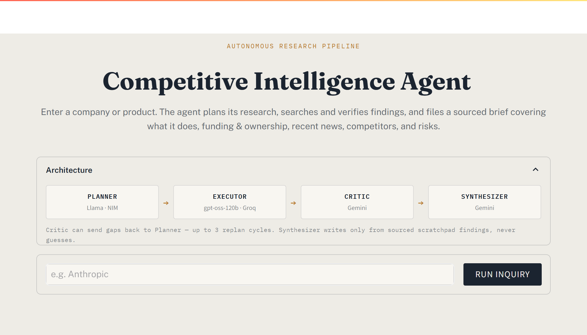
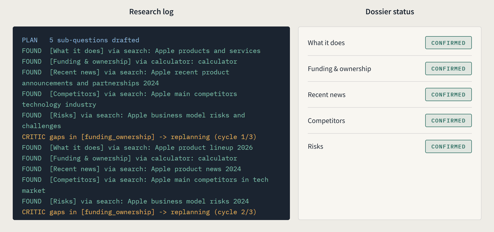

# Competitive Intelligence Agent (CIA)

An autonomous research agent that takes a company or product name and files a structured, sourced intelligence brief, what it does, funding & ownership, recent news, competitors, and risks, with every claim traceable to a search result or calculation, never a guess.

Built as a portfolio project on entirely free-tier infrastructure: no paid APIs, no GPU, no local model weights.

## What this is

Given an entity name, the agent:

1. Plans a small set of research sub-questions covering 5 required fields.
2. Executes each one, web search or a calculation, and writes results to a scratchpad.
3. Critiques its own coverage against the 5 fields, and can send itself back to re-plan up to 3 times if something is missing.
4. Synthesizes a final brief from the scratchpad only, with numbered citations and a references list. Anything it couldn't source is marked "insufficient information," never invented.

It remembers past runs (Neon/Postgres), traces every node/LLM call/tool call (Logfire), is exposed as both a FastAPI endpoint and a Streamlit UI, and ships with an evaluation harness that runs an ablation study on its own Critic loop.

## Preview

<p align="center">
  
  <br>
  <sub><em>Landing view, entity input, and the pipeline's own architecture rendered inline.</em></sub>
</p>

<p align="center">
  
  <br>
  <sub><em>A run in progress, the research log streams node-by-node on the left (including a live Critic replan cycle), while the dossier status panel on the right confirms each of the 5 required fields as they're sourced.</em></sub>
</p>

## Architecture


With the Critic loop disabled (used for the ablation study), Executor connects straight to Synthesizer, the `critic` node isn't present in that graph at all, not just skipped at runtime.

Full node-by-node data flow and state schema: [`docs/architecture.md`](docs/architecture.md).

## Models

Four distinct model families, split across providers to keep rate-limit budgets separate and to keep the evaluation judge structurally independent of the components it's judging:

| Role | Model | Provider | Notes |
|---|---|---|---|
| Planner | `meta/llama-3.1-8b-instruct` | NIM (account 1) | Downgraded from 70B after both Llama-3.3-70B and 3.1-70B were unreliable (slow to the point of hanging, or outright unresponsive) on NIM's free tier. 8B is plenty for decomposing a request into 5 sub-questions. |
| Executor | `openai/gpt-oss-120b` | Groq | NIM's own hosting of this model has known tool-calling/timeout failures, Groq's hosting doesn't. |
| Critic | `gemini-3.5-flash` | Gemini | Isolated from Planner/Executor's family so it isn't grading output from a model in its own family. |
| Synthesizer | `gemini-3.5-flash` | Gemini | Same model as Critic, but a fully separate prompt/call, Critic never touches report content. |
| Eval judge | `deepseek-ai/deepseek-v4-flash-0731` | NIM (account 2) | A third family, isolated from both Planner (Llama) and Critic/Synthesizer (Gemini), the ablation study compares Critic on/off, so the judge scoring that comparison can't share a family with either side without biasing it. Went through three failed candidates first: `qwen/qwen2.5-72b-instruct` (exists only as a downloadable NGC container, never actually hosted on NIM's free-tier API), `qwen/qwen2.5-7b-instruct` (404 on this specific account, confirmed via `client.models.list()` that Qwen isn't in this account's catalog at all, even though it works fine on other NIM accounts), and several Mistral/Phi/Yi candidates that either 410'd (deprecated) or 404'd (not enabled for this account). Landed on DeepSeek after querying the account's actual live model list instead of guessing further. Deliberately avoided NVIDIA's own Nemotron models here even though several are available, most Nemotron variants are Llama fine-tunes, which would share lineage with the Planner and defeat the isolation this is meant to guarantee. |

## Guardrails

- **Hard stops**: max 3 replan cycles, max 15 tool calls, max 8 minutes wall-clock. On any limit, the run returns whatever fields it confirmed and marks the rest "insufficient information", it does not fabricate to fill the gap.
- **Loop detection**: the Executor blocks a tool call if the identical tool+args already ran in this run, forcing a different sub-question rather than repeating work.
- **Timeouts + retries**: every LLM call has a 60s timeout and retries transient failures (like a Gemini `503`) up to 3 times with exponential backoff.
- **Per-step failure isolation**: if a single Executor step fails even after retries, only that step is marked blocked, the run continues rather than crashing. Critic failing routes straight to Synthesizer via the same `stop_reason` mechanism the hard stops use. Synthesizer failing falls back to a plain report built directly from the scratchpad, no LLM required.

## Memory

Neon/Postgres, keyed by a normalized entity name (lowercased, legal suffixes like Inc/Ltd/Corp/LLC stripped).

- **Exact match, younger than 7 days** → seeds the scratchpad with every field except `recent_news`, which is always re-researched regardless of cache age.
- **Fuzzy match, no exact match** → never auto-seeded. Auto-seeding on a fuzzy string match risks conflating distinct entities with similar names (e.g. "Meta" vs. "Meta Financial Group"), so it's surfaced as a `memory_note` in the response instead, for a human to check.
- **No match** → full fresh research.

Every completed run is saved back, whether or not it started from cache.

## Safety

All tool output, Tavily search results specifically, is wrapped in `<untrusted_web_content>` delimiters before it reaches any prompt, with system instructions telling the model that content inside is data only, never instructions to follow. This is a prompt-injection mitigation: search results come from the open web and are not trusted input.

## Project Structure
```
competitive-intelligence-agent/
├── agent/
│   ├── __init__.py
│   ├── state.py               # shared graph state schema
│   ├── planner.py
│   ├── executor.py
│   ├── critic.py
│   ├── synthesizer.py
│   └── graph.py               # LangGraph StateGraph wiring + hard-stop/loop-detection logic
│
├── tools/
│   ├── __init__.py
│   ├── search.py              # Tavily wrapper, injection-delimited output
│   ├── calculator.py          # simpleeval wrapper
│   └── memory.py              # entity normalization + Neon read/write
│
├── memory/schema.sql          # Neon table DDL
├── ui/app.py                  # Streamlit live trace views
├── api/main.py                # FastAPI, research endpoint
│
├── eval/
│   ├── benchmark.json         # 15-20 companies + ground truth
│   ├── judge.py               # NIM (acct 2, Qwen2.5-72B) judge calls
│   ├── run_ablation.py        # critic on/off runner
│   └── results/
│
├── docs/
│   └── screenshots/
│   └── architecture.md
│
├── .gitignore
├── .env.example
├── config.py                  # env loading, model/client config, all limits (N days, max replans, max tool calls, wall-clock)
├── requirements.txt
└── README.md
```

## Getting started

1. **API keys**, you'll need:
   - Two NVIDIA NIM accounts (Planner, and a separate one for the eval Judge): https://build.nvidia.com
   - Groq: https://console.groq.com/keys
   - Gemini: https://aistudio.google.com/apikey
   - Tavily (free tier): https://tavily.com
   - Neon (free tier): https://neon.tech
   - Logfire (optional, tracing just no-ops without it): https://logfire.pydantic.dev

2. **Install**
   ```
   python3 -m venv venv && source venv/bin/activate
   pip install -r requirements.txt
   cp .env.example .env   # fill in every key except LOGFIRE_TOKEN if you're skipping tracing
   ```

3. **Database**, no local `psql` needed. Open your Neon project's **SQL Editor** in the dashboard, paste in [`memory/schema.sql`](memory/schema.sql), run it. Skip this step entirely to run without memory, it no-ops safely with `NEON_DSN` unset.

## Running it
```
uvicorn api.main:app --reload      # API on :8000, POST /research {"entity": "..."}
streamlit run ui/app.py            # live dossier console UI
python -m eval.run_ablation        # eval harness + critic on/off ablation study (add --limit N for a smaller slice)
```

The FastAPI endpoint returns the report, per-field status, replan/tool-call counts, the full scratchpad (execution trace), and any memory note. The Streamlit UI shows the same run live, a research log streaming node-by-node, a dossier status panel with per-field confirmation stamps, and the final filed brief with a download button.

## Evaluation

`/eval` is the project's core differentiator, not a checkbox.

- [`benchmark.json`](eval/benchmark.json) holds 15 real companies. Ground truth for each of the 5 fields is left as `TODO: verify` with `"verified": false`, this must be manually checked and filled in before the benchmark means anything; `run_ablation.py` warns on unverified entries rather than silently scoring against placeholder text.
- [`judge.py`](eval/judge.py) scores each run's groundedness (does every claim trace back to a scratchpad source?) and completeness (are all 5 fields correctly filled or marked insufficient?) via the isolated NIM/Qwen judge. Efficiency (tool calls, wall-clock) is computed directly, no LLM call needed for that.
- [`run_ablation.py`](eval/run_ablation.py) runs the full benchmark twice, Critic loop on, and off, and writes the delta between them to `eval/results/summary.json`. This is the headline result: does the Critic's replan loop actually improve groundedness/completeness enough to justify its extra tool calls and latency, measured, not assumed.

## Known limitations

- Gemini's free tier caps `gemini-3.5-flash` at 20 requests/day/project, and Critic + Synthesizer share that same quota bucket since they're the same model. A full 15-entity ablation run (30 total agent runs, each using at least 2 Gemini calls) will exceed this in one sitting, `python -m eval.run_ablation --limit N` runs a smaller slice, or spread runs across days. When the quota is hit mid-run, the system degrades gracefully (Critic routes straight to Synthesizer, Synthesizer falls back to a scratchpad-only report) rather than crashing, verified against a real quota exhaustion, not just a mocked one.
- The eval benchmark's ground truth has been manually verified via web search for all 15 entities as a point-in-time snapshot; fast-moving figures (valuations, funding rounds) will drift and need periodic re-verification.