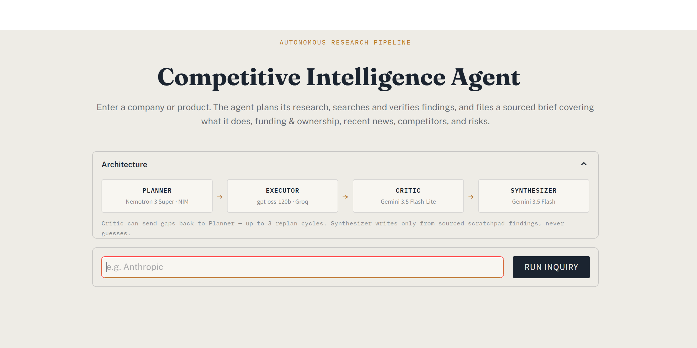
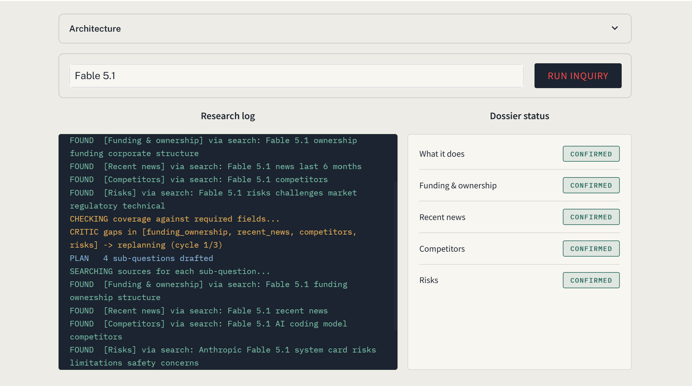
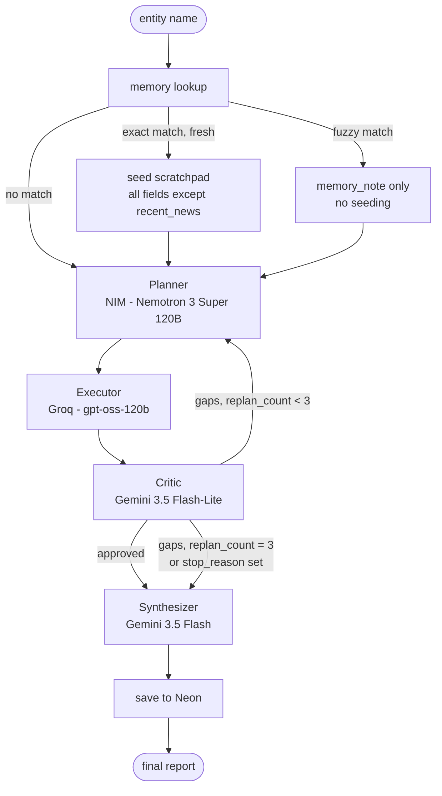

# Competitive Intelligence Agent (CIA)

An autonomous research agent that takes a company or product name as input and delivers a structured, sourced intelligence brief, addressing what it does/is, funding & ownership, recent news, competitors, and risks, with every claim traceable to a search result or calculation, never a guess.

Built as a portfolio project on entirely free-tier infrastructure: no paid APIs, no GPU, no local model.

## Preview

<p align="center">
  
  <br>
  <sub>Landing view, entity input, and the pipeline's own architecture rendered inline.</sub>
</p>

<p align="center">
  
  <br>
  <sub>A run in progress, the research log streams node-by-node on the left (including a live Critic replan cycle), while the dossier status panel on the right confirms each of the 5 required fields as they're sourced.</sub>
</p>

> Additional screenshots and example report in [`assets/`](assets/).

## What this is

Given an entity name, the agent:

1. Plans a small set of research sub-questions covering 5 required fields.
2. Executes each one, web search or a calculation, and writes results to a scratchpad.
3. Critiques its own coverage against the 5 fields, and can send itself back to re-plan up to 3 times if something is missing.
4. Synthesizes a final brief from the scratchpad only, with numbered citations and a references list. Anything it couldn't source is marked "insufficient information," never invented.

It remembers past runs (Neon/Postgres), traces every node/LLM call/tool call (Logfire), is exposed as both a FastAPI endpoint and a Streamlit UI, and ships with an evaluation harness that runs an ablation study on its own Critic loop.

## Architecture



With the Critic loop disabled (used for the ablation study), Executor connects straight to Synthesizer, the `critic` node isn't present in that graph at all, not just skipped at runtime.

Full node-by-node data flow and state schema: [`docs/architecture.md`](docs/architecture.md).

## Models

Each role's model and provider were chosen by matching free-tier rate limits (RPM/TPM/RPD) against that role's actual call volume per run, not just picked for variety:

| Role | Model | Provider | Calls/run | Why this model, this provider |
|---|---|---|---|---|
| Planner | `nvidia/nemotron-3-super-120b-a12b` | NIM | 1 to 4 | NVIDIA's own model for multi-step task planning and complex multi-agent applications. Low-volume role. |
| Executor | `openai/gpt-oss-120b` | Groq | up to 15 | Highest-volume, most latency-sensitive role so it gets Groq's LPU-speed inference. |
| Critic | `gemini-3.5-flash-lite` | Gemini | 1 to 4 | Lightweight JSON gap-classification task, doesn't need full Flash's reasoning quality. Gets meaningfully higher RPM/RPD than full Flash. |
| Synthesizer | `gemini-3.5-flash` | Gemini | 1 | The one call per run that produces what the user actually reads, worth spending the pricier full-Flash quota on. |
| Eval judge | `openai/gpt-oss-120b` | Groq | eval-only | Separate Groq use case from the Executor so the judge isn't from the same model family as anything it's grading. |


## Guardrails

- **Hard stops**: max 3 replan cycles, max 15 tool calls, max 8 minutes wall-clock. On any limit, the run returns whatever fields it confirmed and marks the rest "insufficient information," it does not fabricate to fill the gap.
- **Loop detection + reuse**: the Executor skips the actual tool call if the identical tool+args already ran in this run, but still records a scratchpad entry for the current field from the cached result, so a duplicate query never leaves a *different* field's step uncovered just because another field happened to ask the same thing first.
- **Timeouts + retries**: every LLM call has a 60s timeout and retries transient failures (like a Gemini `503`) up to 3 times with exponential backoff. A call that fails for a non-retryable reason (bad API key, 401/403) fails immediately instead of burning the full backoff. `tools/search.py` retries a transient Tavily failure once before giving up on that step.
- **Per-step failure isolation**: a step whose tool args or tool call genuinely fail is marked `failed`; a step skipped because its query duplicates one already answered this run is marked `blocked`. These are tracked and logged separately so a real failure is never reported to the user as "duplicate, skipped." Critic failing routes straight to Synthesizer via the same `stop_reason` mechanism the hard stops use. Synthesizer failing falls back to a plain report built directly from the scratchpad, no LLM required.

## Memory

Neon/Postgres, keyed by a normalized entity name (lowercased, legal suffixes like Inc/Ltd/Corp/LLC stripped).

- **Exact match, younger than 7 days**: seeds the scratchpad with every `"confirmed"` field except `recent_news`, which is always re-researched regardless of cache age. A field the prior run left as `"insufficient information"` was never cached in the first place, so it's simply absent and gets researched fresh.
- **Fuzzy match, no exact match**: never auto-seeded. Matching uses RapidFuzz's `WRatio`, which is substring-aware, so "Meta" vs. "Meta Financial Group" scores high enough to surface a `memory_note` instead of silently conflating the two entities; a plain edit-distance ratio would score that pair too low to ever trigger the warning.
- **No match**: full fresh research.

Every completed run is saved back, whether or not it started from cache, but only the fields the Synthesizer marked `"confirmed"` are written. A field abandoned by a hard stop (max replans, max tool calls, wall-clock) is never cached, so a degraded run can't quietly seed a future one with weak data. If a field was researched more than once in the same run (e.g. across a replan cycle), every scratchpad entry for it is kept in the cache, not just the last one written.

## Safety

All tool output, Tavily search results specifically, is wrapped in `<untrusted_web_content>` delimiters before it reaches any prompt, with system instructions telling the model that content inside is data only, never instructions to follow. This is a prompt-injection mitigation: search results come from the open web and are not trusted input.

## Project Structure
```
competitive-intelligence-agent/
├── agent/
│   ├── __init__.py
│   ├── state.py               # shared graph state schema
│   ├── schemas.py             # pydantic validation for every LLM JSON response
│   ├── guardrails.py          # shared wall-clock check
│   ├── planner.py
│   ├── executor.py
│   ├── critic.py
│   ├── synthesizer.py
│   └── graph.py               # LangGraph StateGraph wiring + hard-stop/loop-detection logic
│
├── tools/
│   ├── __init__.py
│   ├── search.py              # Tavily wrapper, injection-delimited output
│   ├── calculator.py          # simpleeval wrapper
│   └── memory.py              # entity normalization + Neon read/write
│
├── docs/architecture.md
├── memory/schema.sql          # Neon table DDL
│
├── ui/app.py                  # Streamlit live trace views
├── api/main.py                # FastAPI, research endpoint
│
├── eval/
│   ├── benchmark.json         # 15 companies + ground truth
│   ├── judge.py               # Groq (openai/gpt-oss-120b) judge calls, scores + notes
│   ├── run_ablation.py        # critic on/off runner
│   └── results/
│
├── .streamlit/config.toml     # locked light theme
├── assets/
│
├── .gitignore
├── .env.example
├── config.py                  # env loading, model/client config, all limits (N days, max replans, max tool calls, wall-clock)
├── requirements.txt
├── README.md
└── FIXES.md                   # changelog for the bug/flaw fixes applied in this revision
```

## Getting started

1. **API keys**, you'll need:
   - NVIDIA NIM (Planner): https://build.nvidia.com
   - Groq, for two separate use cases, Executor and the eval Judge: https://console.groq.com/keys. On a paid Groq plan, one key covers both (`GROQ_EXECUTOR_API_KEY` and `GROQ_JUDGE_API_KEY` can just point at the same key). This repo's `.env.example` splits them because it's built against free-tier accounts, where keeping the Executor's per-run call volume off the Judge's quota (and vice versa) actually matters, see the Models table above.
   - Gemini, for two more use cases, Critic and Synthesizer, on two different models: https://aistudio.google.com/apikey
   - Tavily (free tier): https://tavily.com
   - Neon (free tier): https://neon.tech
   - Logfire (optional, tracing just no-ops without it): https://logfire.pydantic.dev

2. **Install**
   ```
   python3 -m venv venv && source venv/bin/activate
   pip install -r requirements.txt
   cp .env.example .env   # fill in every key except LOGFIRE_TOKEN if you're skipping tracing
   ```

3. **Database**, no local `psql` needed. Open your Neon project's **SQL Editor** in the dashboard, paste in [`memory/schema.sql`](memory/schema.sql), run it. Skip this step entirely to run without memory, it no-ops safely with `NEON_DSN` unset.

## Running it
```
uvicorn api.main:app --reload      # API on :8000, POST /research {"entity": "..."}
streamlit run ui/app.py            # live dossier console UI
python -m eval.run_ablation        # eval harness + critic on/off ablation study (add --limit N for a smaller slice)
```

The FastAPI endpoint returns the report, per-field status, replan/tool-call counts, the full scratchpad (execution trace), and any memory note. The Streamlit UI shows the same run live, a research log streaming node-by-node, a dossier status panel with per-field confirmation stamps, and the final filed brief with a download button.

## Evaluation

`/eval` is the project's core differentiator, not a checkbox.
 
- [`benchmark.json`](eval/benchmark.json) holds 15 real companies with ground truth manually verified via web search and `"verified": true` on every entry; `run_ablation.py` warns if any entry is left unverified rather than silently scoring against placeholder text.
- [`judge.py`](eval/judge.py) scores each run's groundedness (does every claim trace back to a scratchpad source?) and completeness (are all 5 fields correctly filled or marked insufficient?) via a Groq (`openai/gpt-oss-120b`) judge on its own use case, isolated from the Executor's quota and from the Gemini family it may end up grading. Every score is saved alongside a one or two sentence note from the judge explaining why it landed there, in `eval/results/with_critic.json` and `without_critic.json`, not just the raw number. Efficiency (tool calls, wall-clock) is computed directly, no LLM call needed for that.
- [`run_ablation.py`](eval/run_ablation.py) runs the full benchmark twice, Critic loop on, and off, and writes the delta between them to `eval/results/summary.json`. This is the headline result: does the Critic's replan loop actually improve groundedness/completeness enough to justify its extra tool calls and latency, measured, not assumed. At small `--limit` values the per-entity scores are noisy (LLM-judge variance dominates at n of 3 or so), read the notes alongside the numbers before drawing a conclusion, and prefer running the full 15-entity benchmark when the free-tier quotas allow it.

## Evaluation Metrics (Local Run)

This is a local evaluation run, not a benchmark. The results are included to demonstrate the evaluation pipeline and provide a concrete end-to-end sanity check.

5-entity local slice of the 15-entity benchmark (Anthropic, Stripe, Notion, Figma, Databricks), Critic on vs. Critic off, against model stack (Planner on NIM Nemotron, Executor on Groq `gpt-oss-120b`, Critic on `gemini-3.5-flash-lite`, Synthesizer on `gemini-3.5-flash`, judged by a separate Groq `gpt-oss-120b` use case):

| Metric | With Critic | Without Critic | Δ |
|---|---|---|---|
| `avg_groundedness` (0-5) | 4.4 | 3.6 | +0.8 |
| `avg_completeness` (0-5) | 4.8 | 3.8 | +1.0 |
| `avg_tool_calls` | 11.4 | 6.2 | +5.2 |
| `avg_elapsed_seconds` | ~103 | ~41 | +62 |
| `avg_replan_count` | 1.4 (of max 3) | n/a, no critic node in this graph | — |
| `scored_entities` / `total_entities` | 5 / 5 | 5 / 5 | — |

This is the outcome the Critic loop produced: roughly double the tool calls and elapsed time in exchange for a meaningful bump in both groundedness and completeness, mostly from `recent_news` and `risks` (the two fields most likely to come back thin on a single pass) getting a second, targeted search after the Critic flags them as gaps.

`n=5` is a smoke test, not a statistically meaningful sample, at this size a single noisy judge call can move an
average by 0.2, read the full 15-entity run's per-entity `groundedness_notes`/`completeness_notes` in `eval/results/` before treating any delta at this scale as a real finding.

## Known limitations

- Gemini's free tier enforces a daily request cap per model per project (check your live numbers in the AI Studio dashboard, Google doesn't publish a fixed figure and it varies by model and account history). Critic (`gemini-3.5-flash-lite`) and Synthesizer (`gemini-3.5-flash`) run on different models specifically so they draw from separate quota buckets instead of one shared cap, but each bucket is still finite.
- Groq's free tier caps `openai/gpt-oss-120b` at 1,000 requests/day per key. The Executor can use up to 15 of those per run (`MAX_TOOL_CALLS`), which puts a real ceiling of roughly 60 to 70 full research runs/day on the Executor's key, the tightest constraint in the whole pipeline.
- At small ablation sample sizes, the Critic's measured effect on groundedness/completeness is dominated by LLM-judge scoring variance, not the Critic itself.