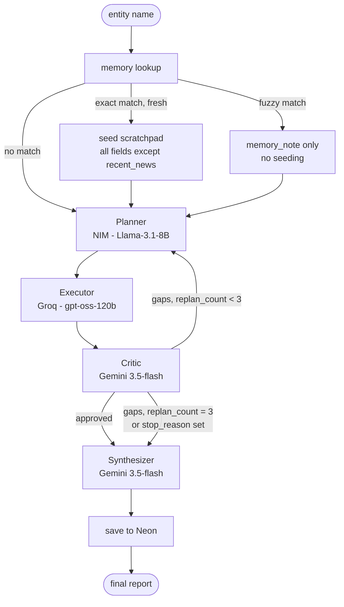

# Competitive Intelligence Agent (CIA)

An autonomous research agent that takes a company or product name and files a structured,
sourced intelligence brief — what it does, funding & ownership, recent news, competitors, and
risks — with every claim traceable to a search result or calculation, never a guess.

Built as a portfolio project on entirely free-tier infrastructure: no paid APIs, no GPU, no local
model weights.

## Contents

- [What this is](#what-this-is)
- [Architecture](#architecture)
- [Models](#models)
- [Guardrails](#guardrails)
- [Memory](#memory)
- [Safety](#safety)
- [Getting started](#getting-started)
- [Running it](#running-it)
- [Evaluation](#evaluation)
- [Project structure](#project-structure)
- [Known limitations](#known-limitations)

## What this is

Given an entity name, the agent:

1. Plans a small set of research sub-questions covering 5 required fields.
2. Executes each one — web search or a calculation — and writes results to a scratchpad.
3. Critiques its own coverage against the 5 fields, and can send itself back to re-plan up to
   3 times if something is missing.
4. Synthesizes a final brief from the scratchpad only, with numbered citations and a references
   list. Anything it couldn't source is marked "insufficient information," never invented.

It remembers past runs (Neon/Postgres), traces every node/LLM call/tool call (Logfire), is
exposed as both a FastAPI endpoint and a Streamlit UI, and ships with an evaluation harness that
runs an ablation study on its own Critic loop.

## Architecture



With the Critic loop disabled (used for the ablation study), Executor connects straight to
Synthesizer — the `critic` node isn't present in that graph at all, not just skipped at runtime.

Full node-by-node data flow and state schema: [`docs/architecture.md`](docs/architecture.md).

## Models

Four distinct model families, split across providers to keep rate-limit budgets separate and to
keep the evaluation judge structurally independent of the components it's judging:

| Role | Model | Provider | Notes |
|---|---|---|---|
| Planner | `meta/llama-3.1-8b-instruct` | NIM (account 1) | Downgraded from 70B after both Llama-3.3-70B and 3.1-70B were unreliable (slow to the point of hanging, or outright unresponsive) on NIM's free tier. 8B is plenty for decomposing a request into 5 sub-questions. |
| Executor | `openai/gpt-oss-120b` | Groq | NIM's own hosting of this model has known tool-calling/timeout failures — Groq's hosting doesn't. |
| Critic | `gemini-3.5-flash` | Gemini | Isolated from Planner/Executor's family so it isn't grading output from a model in its own family. |
| Synthesizer | `gemini-3.5-flash` | Gemini | Same model as Critic, but a fully separate prompt/call — Critic never touches report content. |
| Eval judge | `qwen/qwen2.5-7b-instruct` | NIM (account 2) | A third family, isolated from both Planner (Llama) and Critic/Synthesizer (Gemini) — the ablation study compares Critic on/off, so the judge scoring that comparison can't share a family with either side without biasing it. Originally spec'd as the 72B variant, which 404'd — that model exists as a downloadable NGC container for self-hosting but isn't actually live on NIM's hosted free-tier API, only the 7B is. |

Rejected along the way: NIM's `gpt-oss-120b` (serving-backend failures), Groq's
`llama-3.3-70b-versatile` (deprecated), Gemini 2.0 line (retired).

## Guardrails

- **Hard stops**: max 3 replan cycles, max 15 tool calls, max 8 minutes wall-clock. On any limit,
  the run returns whatever fields it confirmed and marks the rest "insufficient information" —
  it does not fabricate to fill the gap.
- **Loop detection**: the Executor blocks a tool call if the identical tool+args already ran in
  this run, forcing a different sub-question rather than repeating work.
- **Timeouts + retries**: every LLM call has a 60s timeout and retries transient failures (like a
  Gemini `503`) up to 3 times with exponential backoff.
- **Per-step failure isolation**: if a single Executor step fails even after retries, only that
  step is marked blocked — the run continues rather than crashing. Critic failing routes straight
  to Synthesizer via the same `stop_reason` mechanism the hard stops use. Synthesizer failing
  falls back to a plain report built directly from the scratchpad, no LLM required.

## Memory

Neon/Postgres, keyed by a normalized entity name (lowercased, legal suffixes like
Inc/Ltd/Corp/LLC stripped).

- **Exact match, younger than 7 days** → seeds the scratchpad with every field except
  `recent_news`, which is always re-researched regardless of cache age.
- **Fuzzy match, no exact match** → never auto-seeded. Auto-seeding on a fuzzy string match risks
  conflating distinct entities with similar names (e.g. "Meta" vs. "Meta Financial Group"), so
  it's surfaced as a `memory_note` in the response instead, for a human to check.
- **No match** → full fresh research.

Every completed run is saved back, whether or not it started from cache.

## Safety

All tool output — Tavily search results specifically — is wrapped in
`<untrusted_web_content>` delimiters before it reaches any prompt, with system instructions
telling the model that content inside is data only, never instructions to follow. This is a
prompt-injection mitigation: search results come from the open web and are not trusted input.

## Getting started

1. **API keys** — you'll need:
   - Two NVIDIA NIM accounts (Planner, and a separate one for the eval Judge): https://build.nvidia.com
   - Groq: https://console.groq.com/keys
   - Gemini: https://aistudio.google.com/apikey
   - Tavily (free tier): https://tavily.com
   - Neon (free tier): https://neon.tech
   - Logfire (optional — tracing just no-ops without it): https://logfire.pydantic.dev

2. **Install**
   ```
   python3 -m venv venv && source venv/bin/activate
   pip install -r requirements.txt
   cp .env.example .env   # fill in every key except LOGFIRE_TOKEN if you're skipping tracing
   ```

3. **Database** — no local `psql` needed. Open your Neon project's **SQL Editor** in the
   dashboard, paste in [`memory/schema.sql`](memory/schema.sql), run it. Skip this step entirely
   to run without memory — it no-ops safely with `NEON_DSN` unset.

## Running it

```
uvicorn api.main:app --reload      # API on :8000 — POST /research {"entity": "..."}
streamlit run ui/app.py             # live dossier console UI
python -m eval.run_ablation          # eval harness + critic on/off ablation study
```

The FastAPI endpoint returns the report, per-field status, replan/tool-call counts, the full
scratchpad (execution trace), and any memory note. The Streamlit UI shows the same run live —
a research log streaming node-by-node, a dossier status panel with per-field confirmation stamps,
and the final filed brief with a download button.

## Evaluation

`/eval` is the project's core differentiator, not a checkbox.

- [`benchmark.json`](eval/benchmark.json) holds 15 real companies. Ground truth for each of the 5
  fields is left as `TODO: verify` with `"verified": false` — this must be manually checked and
  filled in before the benchmark means anything; `run_ablation.py` warns on unverified entries
  rather than silently scoring against placeholder text.
- [`judge.py`](eval/judge.py) scores each run's groundedness (does every claim trace back to a
  scratchpad source?) and completeness (are all 5 fields correctly filled or marked
  insufficient?) via the isolated NIM/Qwen judge. Efficiency (tool calls, wall-clock) is computed
  directly, no LLM call needed for that.
- [`run_ablation.py`](eval/run_ablation.py) runs the full benchmark twice — Critic loop on, and
  off — and writes the delta between them to `eval/results/summary.json`. This is the headline
  result: does the Critic's replan loop actually improve groundedness/completeness enough to
  justify its extra tool calls and latency, measured, not assumed.

## Project structure

```
/agent        LangGraph nodes: state, planner, executor, critic, synthesizer, graph, llm, tracing
/tools        search.py, calculator.py, memory.py
/eval         benchmark.json, judge.py, run_ablation.py, results/
/memory       Neon schema
/api          FastAPI app
/ui           Streamlit dossier console
/docs         architecture notes
config.py     all model assignments and tunable limits in one place
```

## Known limitations

- Nothing here has been load-tested; free-tier rate limits on NIM/Groq/Tavily will bite under
  concurrent use.
- The eval benchmark's ground truth is a scaffold, not verified data — see Evaluation above.
- The Streamlit UI's custom CSS targets Streamlit's `data-testid` attributes, which are stable
  across recent versions but not a public API guarantee; a future Streamlit upgrade could change
  them, at worst degrading styling, not functionality.
- No automated test suite. Everything in this repo has been verified via manual smoke tests and
  mocked unit-level checks during development, not CI.

## Constraints

All free-tier APIs, no paid resources, no local model weights, no GPU dependency.
