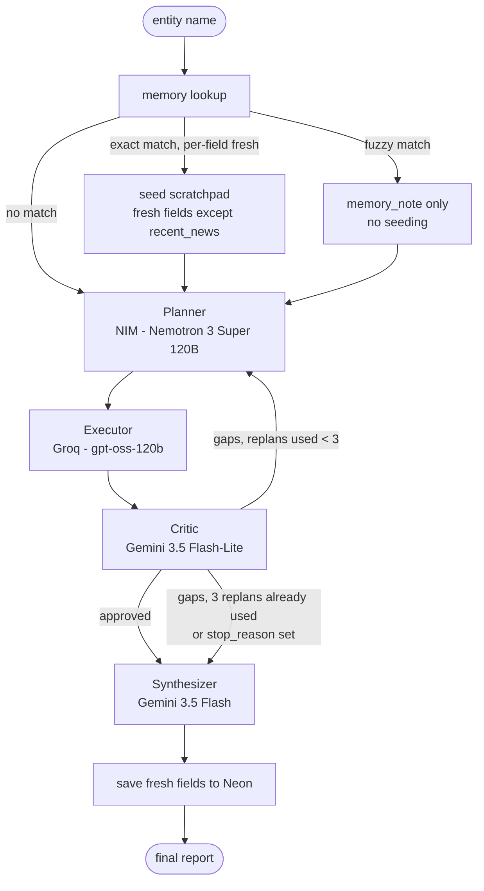

# Competitive Intelligence Agent (CIA)

An autonomous research agent that takes a company or product name as input and delivers a structured, sourced intelligence brief covering what it does, funding and ownership, recent news, competitors, and risks. Every claim is traceable to a search result or a recorded calculation, and anything that could not be sourced is marked "insufficient information" instead of being guessed.

Built as a portfolio project on entirely free-tier infrastructure: no paid APIs, no GPU, no local model.

## Preview

<p align="center">
  
  <br>
  <sub>Landing view, entity input, and the pipeline's own architecture rendered inline.</sub>
</p>

<p align="center">
  
  <br>
  <sub>A run in progress: the research log streams node-by-node on the left (including a live Critic replan cycle), while the dossier status panel on the right stamps each of the 5 required fields as it is sourced.</sub>
</p>

> Additional screenshots and an example report in [`assets/`](assets/).

## What this is

Given an entity name, the agent:

1. **Plans** a small set of research sub-questions (at most 8 per plan) covering the 5 required fields, skipping any field already confirmed from cache.
2. **Executes** each one, as a web search or a calculation, and writes the results to a scratchpad.
3. **Critiques** its own coverage against the 5 fields, and can send itself back to re-plan up to 3 times if something is missing. Each replan targets only the flagged gaps and avoids repeating earlier queries.
4. **Synthesizes** a final brief from the scratchpad only, with numbered citations and a references list. Field statuses are checked against the scratchpad, so a field cannot be reported as confirmed without evidence behind it.

It remembers past runs per field (Neon/Postgres), traces every node, LLM call and tool call (Logfire), is exposed as both a FastAPI endpoint and a Streamlit UI, and ships with an evaluation harness that runs a paired ablation study on its own Critic loop.

## Architecture


```mermaid
flowchart TD
    start([entity name]) --> mem[memory lookup]
    mem -->|exact match, per-field fresh| seed[seed scratchpad\nfresh fields except recent_news]
    mem -->|fuzzy match| note[memory_note only\nno seeding]
    mem -->|no match| planner
    seed --> planner
    note --> planner

    planner[Planner\nNIM - Nemotron 3 Super 120B] --> executor[Executor\nGroq - gpt-oss-120b]
    executor --> critic[Critic\nGemini 3.5 Flash-Lite]
    critic -->|approved| synthesizer[Synthesizer\nGemini 3.5 Flash]
    critic -->|gaps, replans used < 3| planner
    critic -->|gaps, 3 replans already used\nor stop_reason set| synthesizer
    synthesizer --> save[save fresh fields to Neon]
    save --> report([final report])
```

A full run is at most 4 Planner calls and 4 Critic calls: the initial pass plus 3 replans. With the Critic loop disabled (used for the ablation study), Executor connects straight to Synthesizer. The `critic` node is not present in that graph at all, not just skipped at runtime.

Full node-by-node data flow and state schema: [`docs/architecture.md`](docs/architecture.md).

## Models

Models are matched to free-tier rate limits (RPM/TPM/RPD) by each role's call volume:

| Role | Model | Provider | Calls/run | Why this model, this provider |
|---|---|---|---|---|
| Planner | `nvidia/nemotron-3-super-120b-a12b` | NIM | 1 to 4 | NVIDIA's model for multi-step planning. Low-volume role. |
| Executor | `openai/gpt-oss-120b` | Groq | one per pending step, at most 8 steps per plan | Highest-volume, latency-sensitive role, so it gets Groq. Blocked and failed steps still cost a call (see Known limitations). |
| Critic | `gemini-3.5-flash-lite` | Gemini | 1 to 4 | Light JSON gap-classification; needs less quality, gets higher RPM/RPD. |
| Synthesizer | `gemini-3.5-flash` | Gemini | 1 | Writes what the user reads, so it gets full Flash. |
| Eval judge | `openai/gpt-oss-120b` | Groq | eval-only | Separate key keeps judge traffic off the Executor's quota. Grades the Gemini report, never Executor output. |

## Guardrails

| Guardrail | Behavior |
|---|---|
| Hard stops | 3 replans, 15 tool calls, 8 steps per plan, 8 minutes wall-clock. On any limit the run returns what it confirmed and marks the rest "insufficient information". |
| Clock checks | Before the Planner, before the Critic, before each Executor step, and after tool input is generated. The Synthesizer always runs; an in-flight call may finish. |
| Loop detection | The Executor sees queries already run and must vary them. An identical tool and argument pair skips the call and records the cached result for the current field (unless it already holds it), so no field is left uncovered and no evidence is double-counted. |
| Timeouts | 60s per LLM call: client-enforced for NIM and Groq, a watchdog thread for Gemini. |
| Retries | Transient errors (like `503`): 3 attempts, exponential backoff; `429` waits 10s then 20s. Malformed JSON is retried, Tavily once. 400, 401, 403, 404, 422, invalid key and exhausted daily quota fail immediately. Each failed attempt logs a Logfire warning. |
| Failure isolation | Tool args or call fail: step is `failed`. Duplicate skipped: step is `blocked`. Logged separately. |
| Degradation | Critic failure goes straight to the Synthesizer via `stop_reason`. Synthesizer failure or empty report falls back to a plain scratchpad report, marked unverified and never cached. Stop reasons are joined (`max_replans+synthesizer_unavailable`), so the first is never overwritten. |

## Memory

Neon/Postgres, keyed by a normalized entity name (lowercased, legal suffixes like Inc/Ltd/Corp/LLC stripped).

| Lookup | Behavior |
|---|---|
| Exact match | Recent rows merged per field, newest winning, each with its own age in fractional days. Fields under 7 days old, except `recent_news`, are seeded into the scratchpad and not re-planned, so a hit saves tool calls. `recent_news` is always re-researched. |
| Fuzzy match only | Never seeded. RapidFuzz `WRatio` is substring-aware, so "Meta" vs. "Meta Financial Group" is intended to raise a `memory_note` instead of conflating them. Candidates: the 2000 most recently researched entities. |
| No match | Full fresh research. |

**Write-back** keeps only fresh work:
- A field is saved when the Synthesizer marked it `"confirmed"` and the scratchpad holds a non-empty, non-cached entry for it (all such entries kept).
- Cached text is never re-saved, so ages never reset and text never grows.
- A run with nothing new, or one using the fallback report, writes nothing, so it cannot shadow earlier rows.
- Unconfirmed fields, including any cut off by a hard stop, are never cached.

## Safety

| Area | Mitigation | Limit |
|---|---|---|
| Prompt injection | All Tavily output is wrapped in `<untrusted_web_content>` tags. The Planner, Executor, Critic, Synthesizer and Judge prompts treat tagged content as data, never instructions. Literal tags in fetched text are neutralized and truncated excerpts are re-wrapped, so delimiters stay balanced. | A mitigation, not a guarantee. |
| Calculator | Expressions are built from scratchpad findings. Each is stored with its result under source `calculator: <expression>`, so it is traceable. | "Use no other numbers" is a model instruction, not enforced in code. |
| API | Optional `API_ACCESS_KEY` makes `POST /research` require a matching `X-API-Key` header. Entity names are stripped and capped at 200 characters. | No rate limiting. |

## Project Structure

```
competitive-intelligence-agent/
├── agent/
│   ├── __init__.py
│   ├── state.py               # shared graph state schema
│   ├── schemas.py             # pydantic validation for every LLM JSON response
│   ├── guardrails.py          # wall-clock check, combined stop-reason helpers
│   ├── llm.py                 # provider clients, timeouts, retry classification
│   ├── tracing.py             # Logfire setup and node tracing
│   ├── planner.py
│   ├── executor.py
│   ├── critic.py
│   ├── synthesizer.py
│   └── graph.py               # StateGraph wiring, run setup, memory seed and save
│
├── tools/
│   ├── __init__.py
│   ├── search.py              # Tavily wrapper, injection-delimited output
│   ├── calculator.py          # simpleeval wrapper
│   ├── results.py             # untrusted-content wrapper, prompt notice, empty-result detection
│   └── memory.py              # entity normalization + Neon read/write
│
├── docs/architecture.md
├── memory/schema.sql          # Neon table DDL
│
├── ui/app.py                  # Streamlit live trace views
├── api/main.py                # FastAPI, research endpoint
│
├── eval/
│   ├── benchmark.json         # 15 companies + ground truth
│   ├── judge.py               # Groq (openai/gpt-oss-120b) judge calls, scores + notes
│   ├── run_ablation.py        # paired critic on/off runner
│   └── results/
│
├── tests/                     # offline pytest suite, all providers stubbed
├── pytest.ini
│
├── .streamlit/config.toml     # locked light theme
├── assets/
│
├── .gitignore
├── .env.example
├── config.py                  # env loading, model config, all limits (memory days, replans, tool calls, plan steps, wall-clock)
├── requirements.txt           # runtime dependencies
├── requirements-dev.txt       # adds pytest and httpx
└── README.md
```

## Getting started

Requires Python 3.10 or newer (the code uses `X | None` annotations).

1. **API keys**, you'll need:
   - NVIDIA NIM (Planner): https://build.nvidia.com
   - Groq (Executor and eval Judge): https://console.groq.com/keys. The two keys are split for free-tier quotas; on a paid plan both variables can hold the same key.
   - Gemini (Critic and Synthesizer, two models): https://aistudio.google.com/apikey
   - Tavily (free tier): https://tavily.com
   - Neon (free tier): https://neon.tech. `NEON_DSN` is the Postgres connection string from the Neon dashboard (it starts with `postgresql://`).
   - Logfire (optional, tracing no-ops without it): https://logfire.pydantic.dev
   - `API_ACCESS_KEY` (optional): any secret you choose; the API then requires it in `X-API-Key`

2. **Install**
   ```
   python3 -m venv venv && source venv/bin/activate   # on Windows: venv\Scripts\activate
   pip install -r requirements.txt
   cp .env.example .env   # fill in all keys except the optional ones (LOGFIRE_TOKEN, NEON_DSN, API_ACCESS_KEY, and GROQ_JUDGE_API_KEY unless running the eval)
   ```

3. **Database** (optional, no local `psql` needed): paste [`memory/schema.sql`](memory/schema.sql) into your Neon project's SQL Editor and run it. Without `NEON_DSN`, memory safely does nothing.

4. **Testing**
   ```
   pytest tests/ -v
   ```
   Tests run fully offline: `tests/conftest.py` injects fake API keys and stubs every LLM, Tavily and Postgres call. `tests/test_repo_consistency.py` also checks that file and function references in the docs resolve to real code. 

## Running it

Run every command from the repository root so `.env`, imports and `.streamlit/config.toml` are found.

```
uvicorn api.main:app --reload      # API on :8000, POST /research {"entity": "..."} (one request blocks for the whole run, up to about 8 minutes)
streamlit run ui/app.py            # live dossier console UI
python -m eval.run_ablation        # eval harness + critic on/off ablation study (add --limit N for a smaller slice)
```

Example API call (add `-H "X-API-Key: <your key>"` if `API_ACCESS_KEY` is set):

```
curl -X POST http://localhost:8000/research -H "Content-Type: application/json" -d '{"entity": "Stripe"}'
```

The API returns the report, per-field status, replan and tool-call counts, the scratchpad (execution trace) and any memory note. The Streamlit UI shows the same run live: a node-by-node research log, a dossier status panel with per-field stamps, and the filed brief with a download button.

## Evaluation

`/eval` is the project's core differentiator, not a checkbox.

| Component | What it does |
|---|---|
| [`benchmark.json`](eval/benchmark.json) | 15 companies with manually verified ground truth (`"verified": true` on all). A run warns on any unverified entry instead of scoring against placeholders. |
| [`judge.py`](eval/judge.py) | A Groq (`openai/gpt-oss-120b`) judge on its own key scores groundedness (does every claim trace to a scratchpad source?) and completeness (are all 5 fields correct or marked insufficient?), 0 to 5 each, with a short note. Ground truth is a dated snapshot, so a newer sourced `recent_news` finding is not penalized. Tool calls and wall-clock are measured directly, without an LLM. |
| [`run_ablation.py`](eval/run_ablation.py) | Runs the benchmark with the Critic on and off, and writes per-run results (`with_critic.json`, `without_critic.json`) and the delta (`summary.json`) to `eval/results/`. It measures whether replans earn their extra calls and latency. |

Notes:
- **Paired delta**: only entities without an infrastructure failure in both conditions count. Dropped ones appear under `excluded_infra_failures` and `excluded_unpaired`.
- **`--limit N`**: a positive integer; takes the first N entries.
- **Noise**: small slices are dominated by judge variance (near n=3), so read the notes with the numbers and prefer the full 15 when quotas allow.

## Evaluation Metrics (Local Run)

5-entity slice (Anthropic, Stripe, Notion, Figma, Databricks; hand-picked, so `--limit 5` does not reproduce it), Critic on vs. off:

| Metric | With Critic | Without Critic | Delta |
|---|---|---|---|
| `avg_groundedness` (0-5) | 4.6 | 3.8 | +0.8 |
| `avg_completeness` (0-5) | 4.8 | 3.8 | +1.0 |
| `avg_tool_calls` | 10.8 | 6.2 | +4.6 |
| `avg_elapsed_seconds` | ~96 | ~40 | +56 |
| `avg_replan_count` | 1.6 (of max 3) | 0, no critic node in this graph | n/a |
| `scored_entities` / `total_entities` | 5 / 5 | 5 / 5 | n/a |

Expected shape: the Critic costs about 1.7x the tool calls and 2.4x the time, but replans are more productive now. They target only gaps, avoid repeated queries and get a full 3 cycles instead of 2. Completeness was already near its ceiling, so the gain shows mainly in groundedness, which scratchpad-checked statuses and traceable calculations should also lift slightly without the Critic. Pairing removes bias from entities dropped in one condition only.

`n=5` is a smoke test: one noisy judge call can move an average by 0.2, so read the per-entity notes in `eval/results/` before trusting any delta.

## Known limitations

- **Gemini quota**: daily per-model request cap (see the AI Studio dashboard; no fixed published figure). Critic and Synthesizer use different models for separate buckets, but each is finite.
- **Groq quota**: 1,000 requests/day per key for `openai/gpt-oss-120b` on the free tier. Each pending step costs one Executor call, including `blocked` and `failed` ones. Typical use is about 10 to 15 per run, worst case 8 steps x 4 plans = 32, so budget roughly 30 to 90 runs/day. This is the tightest constraint.
- **Wall clock**: enforced between steps, so a run can overrun by one in-flight step.
- **Synthesizer**: `field_status` is checked against the scratchpad, but whether the report text matches those entries is judged by the model, not verified in code.
- **API**: no rate limiting, and each request holds a worker for the whole run. `API_ACCESS_KEY` is the only protection for your quotas.
- **Memory**: freshness is per field, so one entity's fields can be different ages.
- **Ablation**: small samples are dominated by judge variance.