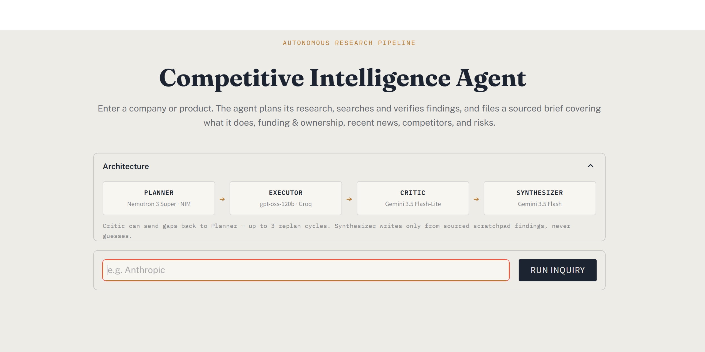
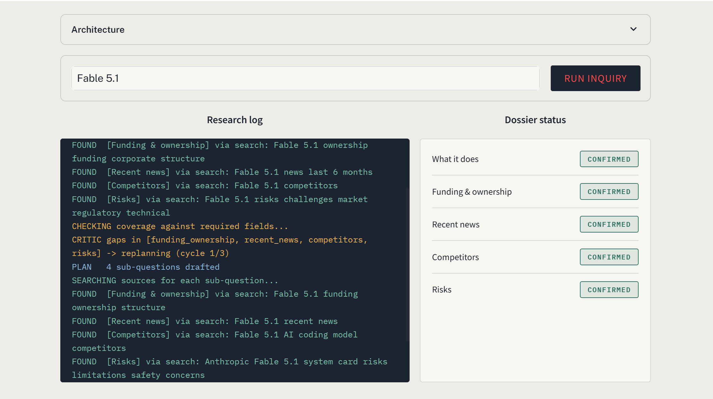

# Competitive Intelligence Agent (CIA)

An autonomous research agent that takes a company or product name as input and delivers a structured, sourced intelligence brief covering what it does, funding and ownership, recent news, competitors, and risks. Every claim is traceable to a search result or a recorded calculation, and anything that could not be sourced is marked "insufficient information" instead of being guessed.

Built as a portfolio project on entirely free-tier infrastructure: no paid APIs, no GPU, no local model.

## Preview

<p align="center">
  
  <br>
  <sub>Landing view, entity input, and the pipeline's own architecture rendered inline.</sub>
</p>

<p align="center">
  
  <br>
  <sub>A run in progress: the research log streams node-by-node on the left (including a live Critic replan cycle), while the dossier status panel on the right stamps each of the 5 required fields as it is sourced.</sub>
</p>

> Additional screenshots and an example report in [`assets/`](assets/).

## What this is

Given an entity name, the agent:

1. Plans a small set of research sub-questions (at most 8 per plan) covering the 5 required fields, skipping any field already confirmed from cache.
2. Executes each one, as a web search or a calculation, and writes the results to a scratchpad.
3. Critiques its own coverage against the 5 fields, and can send itself back to re-plan up to 3 times if something is missing. Each replan targets only the flagged gaps and avoids repeating earlier queries.
4. Synthesizes a final brief from the scratchpad only, with numbered citations and a references list. Field statuses are checked against the scratchpad, so a field cannot be reported as confirmed without evidence behind it.

It remembers past runs per field (Neon/Postgres), traces every node, LLM call and tool call (Logfire), is exposed as both a FastAPI endpoint and a Streamlit UI, and ships with an evaluation harness that runs a paired ablation study on its own Critic loop.

## Architecture


```mermaid
flowchart TD
    start([entity name]) --> mem[memory lookup]
    mem -->|exact match, per-field fresh| seed[seed scratchpad\nfresh fields except recent_news]
    mem -->|fuzzy match| note[memory_note only\nno seeding]
    mem -->|no match| planner
    seed --> planner
    note --> planner

    planner[Planner\nNIM - Nemotron 3 Super 120B] --> executor[Executor\nGroq - gpt-oss-120b]
    executor --> critic[Critic\nGemini 3.5 Flash-Lite]
    critic -->|approved| synthesizer[Synthesizer\nGemini 3.5 Flash]
    critic -->|gaps, replans used < 3| planner
    critic -->|gaps, 3 replans already used\nor stop_reason set| synthesizer
    synthesizer --> save[save fresh fields to Neon]
    save --> report([final report])
```

A full run is at most 4 Planner calls and 4 Critic calls: the initial pass plus 3 replans. With the Critic loop disabled (used for the ablation study), Executor connects straight to Synthesizer. The `critic` node is not present in that graph at all, not just skipped at runtime.

Full node-by-node data flow and state schema: [`docs/architecture.md`](docs/architecture.md).

## Models

Each role's model and provider were chosen by matching free-tier rate limits (RPM/TPM/RPD) against that role's actual call volume per run, not just picked for variety:

| Role | Model | Provider | Calls/run | Why this model, this provider |
|---|---|---|---|---|
| Planner | `nvidia/nemotron-3-super-120b-a12b` | NIM | 1 to 4 | NVIDIA's own model for multi-step task planning and complex multi-agent applications. Low-volume role. |
| Executor | `openai/gpt-oss-120b` | Groq | one per pending step, at most 8 steps per plan | Highest-volume, most latency-sensitive role, so it gets Groq's LPU-speed inference. Steps that end up blocked or failed still cost a call, see Known limitations. |
| Critic | `gemini-3.5-flash-lite` | Gemini | 1 to 4 | Lightweight JSON gap-classification task that does not need full Flash's reasoning quality. Gets meaningfully higher RPM/RPD than full Flash. |
| Synthesizer | `gemini-3.5-flash` | Gemini | 1 | The one call per run that produces what the user actually reads, worth spending the pricier full-Flash quota on. |
| Eval judge | `openai/gpt-oss-120b` | Groq | eval-only | Separate Groq key so judge traffic does not compete with the Executor's quota. It grades the Gemini-written report; the Executor only produces tool inputs, never graded text. |

## Guardrails

- **Hard stops**: max 3 replan cycles, max 15 tool calls, max 8 steps per plan, max 8 minutes wall-clock. The clock is checked before the Planner, before the Critic, before each Executor step, and again after the Executor generates tool input (the Synthesizer always runs so a brief is still produced); a call already in flight is allowed to finish, bounded by the 60s LLM timeout and retries. On any limit, the run returns whatever fields it confirmed and marks the rest "insufficient information"; it does not fabricate to fill the gap.
- **Loop detection and reuse**: the Executor is shown the queries already run and told to vary them. If it still produces an identical tool and argument pair, the tool call is skipped and the cached result is recorded for the current field, unless that field already holds that exact result. A duplicate query therefore never leaves a different field's step uncovered, and never adds the same evidence twice for the Critic to re-read.
- **Timeouts and retries**: every LLM call has a 60s timeout, enforced by the client for NIM and Groq and by a watchdog thread for Gemini. Transient failures (like a `503`) retry up to 3 times with exponential backoff, and a `429` backs off 10s then 20s. A non-retryable failure (400, 401, 403, 404, 422, an invalid key, or an exhausted daily quota) fails immediately instead of burning the full backoff. Malformed JSON from a model is retried like a transient failure. `tools/search.py` retries a transient Tavily failure once. Every failed LLM and search attempt emits a Logfire warning.
- **Per-step failure isolation**: a step whose tool args or tool call genuinely fail is marked `failed`; a step skipped because its query duplicates one already answered this run is marked `blocked`. These are tracked and logged separately so a real failure is never reported as "duplicate, skipped."
- **Graceful degradation**: a Critic failure routes straight to the Synthesizer through the same `stop_reason` mechanism the hard stops use. A Synthesizer failure (or an empty report) falls back to a plain report built from the scratchpad, opens with a note that nothing was verified, and is never written to the cache. When a second reason has to be recorded after an earlier one, the two are joined, for example `max_replans+synthesizer_unavailable`, so the first reason is never overwritten.

## Memory

Neon/Postgres, keyed by a normalized entity name (lowercased, legal suffixes like Inc/Ltd/Corp/LLC stripped).

- **Exact match**: the most recent rows for the entity are merged per field, newest row winning, and each field carries its own age in fractional days. Every field younger than 7 days, except `recent_news`, is seeded into the scratchpad. `recent_news` is always re-researched. A field never marked `"confirmed"` was never cached, so it is simply absent and gets researched fresh.
- **Seeded fields are not re-planned**: on the first pass the Planner is told which fields are already confirmed and plans only the rest, so a cache hit actually saves tool calls.
- **Fuzzy match, no exact match**: never auto-seeded. Matching uses RapidFuzz's `WRatio`, which is substring-aware, so "Meta" vs. "Meta Financial Group" is intended to surface a `memory_note` instead of silently conflating the two entities. Candidates are the 2000 most recently researched entities.
- **No match**: full fresh research.

Only freshly researched fields are written back. A field is saved when the Synthesizer marked it `"confirmed"` and the scratchpad holds at least one non-empty, non-cached entry for it. Cached text is never re-saved, so a finding's age is never reset and its text never grows or nests its own provenance. A run that produced nothing new writes nothing, so it cannot shadow earlier good rows, and a run that used the fallback report writes nothing. A field abandoned by a hard stop is never cached. If a field was researched more than once in the same run, every fresh scratchpad entry for it is kept.

## Safety

All Tavily output is wrapped in `<untrusted_web_content>` delimiters before it reaches any prompt. The Planner, Executor, Critic, Synthesizer and eval Judge system prompts all carry an instruction that content inside those tags is data only, never instructions to follow. Any literal copy of the delimiter tags inside fetched text is neutralized before wrapping, and truncated excerpts are re-wrapped so the delimiters stay balanced. This is a prompt-injection mitigation, not a guarantee: search results come from the open web and are not trusted input.

Calculator steps are built from scratchpad findings: the Executor is given them and instructed to use no other numbers (an instruction to the model, not something the code enforces). Each expression is stored next to its result and the source is labelled `calculator: <expression>`, so a calculated figure can be traced by the Critic, Synthesizer and Judge.

The API can be locked with an optional `API_ACCESS_KEY`: when set, `POST /research` requires a matching `X-API-Key` header. Entity names are stripped and capped at 200 characters.

## Project Structure
```
competitive-intelligence-agent/
├── agent/
│   ├── __init__.py
│   ├── state.py               # shared graph state schema
│   ├── schemas.py             # pydantic validation for every LLM JSON response
│   ├── guardrails.py          # wall-clock check, combined stop-reason helpers
│   ├── llm.py                 # provider clients, timeouts, retry classification
│   ├── tracing.py             # Logfire setup and node tracing
│   ├── planner.py
│   ├── executor.py
│   ├── critic.py
│   ├── synthesizer.py
│   └── graph.py               # StateGraph wiring, run setup, memory seed and save
│
├── tools/
│   ├── __init__.py
│   ├── search.py              # Tavily wrapper, injection-delimited output
│   ├── calculator.py          # simpleeval wrapper
│   ├── results.py             # untrusted-content wrapper, prompt notice, empty-result detection
│   └── memory.py              # entity normalization + Neon read/write
│
├── docs/architecture.md
├── memory/schema.sql          # Neon table DDL
│
├── ui/app.py                  # Streamlit live trace views
├── api/main.py                # FastAPI, research endpoint
│
├── eval/
│   ├── benchmark.json         # 15 companies + ground truth
│   ├── judge.py               # Groq (openai/gpt-oss-120b) judge calls, scores + notes
│   ├── run_ablation.py        # paired critic on/off runner
│   └── results/
│
├── tests/                     # offline pytest suite, all providers stubbed
├── pytest.ini
│
├── .streamlit/config.toml     # locked light theme
├── assets/
│
├── .gitignore
├── .env.example
├── config.py                  # env loading, model config, all limits (memory days, replans, tool calls, plan steps, wall-clock)
├── requirements.txt           # runtime dependencies
├── requirements-dev.txt       # adds pytest and httpx
└── README.md
```

## Getting started

Requires Python 3.10 or newer (the code uses `X | None` annotations).

1. **API keys**, you'll need:
   - NVIDIA NIM (Planner): https://build.nvidia.com
   - Groq, for two separate use cases, Executor and the eval Judge: https://console.groq.com/keys. On a paid Groq plan, one key covers both (`GROQ_EXECUTOR_API_KEY` and `GROQ_JUDGE_API_KEY` can point at the same key). This repo's `.env.example` splits them because it is built against free-tier accounts, where keeping the Executor's per-run call volume off the Judge's quota (and vice versa) matters, see the Models table above.
   - Gemini, for two more use cases, Critic and Synthesizer, on two different models: https://aistudio.google.com/apikey
   - Tavily (free tier): https://tavily.com
   - Neon (free tier): https://neon.tech. `NEON_DSN` is the Postgres connection string from the Neon dashboard (it starts with `postgresql://`).
   - Logfire (optional, tracing no-ops without it): https://logfire.pydantic.dev
   - `API_ACCESS_KEY` (optional): any secret string you choose; when set, the API requires it in an `X-API-Key` header

2. **Install**
   ```
   python3 -m venv venv && source venv/bin/activate   # on Windows: venv\Scripts\activate
   pip install -r requirements.txt
   cp .env.example .env   # fill in every key except the optional ones (LOGFIRE_TOKEN, NEON_DSN, API_ACCESS_KEY, GROQ_JUDGE_API_KEY unless you run the eval)
   ```

3. **Database**, no local `psql` needed. Open your Neon project's **SQL Editor** in the dashboard, paste in [`memory/schema.sql`](memory/schema.sql), run it. Skip this step entirely to run without memory; it no-ops safely with `NEON_DSN` unset.

## Running it

Run every command from the repository root, so that `.env`, the imports and `.streamlit/config.toml` are found.

```
uvicorn api.main:app --reload      # API on :8000, POST /research {"entity": "..."} (one request blocks for the whole run, up to about 8 minutes)
streamlit run ui/app.py            # live dossier console UI
python -m eval.run_ablation        # eval harness + critic on/off ablation study (add --limit N for a smaller slice)
```

Example API call (add `-H "X-API-Key: <your key>"` if `API_ACCESS_KEY` is set):

```
curl -X POST http://localhost:8000/research -H "Content-Type: application/json" -d '{"entity": "Stripe"}'
```

The FastAPI endpoint returns the report, per-field status, replan and tool-call counts, the full scratchpad (execution trace), and any memory note. The Streamlit UI shows the same run live: a research log streaming node-by-node, a dossier status panel with per-field confirmation stamps, and the final filed brief with a download button. The finished run is kept in the session, so downloading the brief (which reruns the page) does not wipe it.

## Evaluation

`/eval` is the project's core differentiator, not a checkbox.

- [`benchmark.json`](eval/benchmark.json) holds 15 real companies with ground truth manually verified via web search and `"verified": true` on every entry; `run_ablation.py` warns if any entry is left unverified rather than silently scoring against placeholder text.
- [`judge.py`](eval/judge.py) scores each run's groundedness (does every claim trace back to a scratchpad source?) and completeness (are all 5 fields correctly filled or marked insufficient?) via a Groq (`openai/gpt-oss-120b`) judge on its own key, isolated from the Executor's quota. The judge is told that ground truth is a dated snapshot, so a newer, sourced `recent_news` finding is not penalized for differing from it. Every score is saved with a one or two sentence note explaining why it landed there, in `eval/results/with_critic.json` and `without_critic.json`, not just the raw number. Efficiency (tool calls, wall-clock) is computed directly, with no LLM call.
- [`run_ablation.py`](eval/run_ablation.py) runs the benchmark twice, Critic loop on and off, and writes the delta to `eval/results/summary.json`. This is the headline result: does the Critic's replan loop improve groundedness and completeness enough to justify its extra tool calls and latency, measured, not assumed. The delta is paired: only entities that finished without an infrastructure failure in both conditions are averaged, and the ones dropped are listed under `excluded_infra_failures` and `excluded_unpaired`. `--limit N` takes the first N benchmark entries and must be a positive integer. At small `--limit` values the per-entity scores are noisy (LLM-judge variance dominates at n of 3 or so), so read the notes alongside the numbers, and prefer the full 15-entity benchmark when free-tier quotas allow.

## Evaluation Metrics (Local Run)

These figures are synthetic: projected expectations for the current code under ideal conditions (no provider outages, no quota exhaustion), not measured results. Regenerate them with `python -m eval.run_ablation` before quoting them anywhere.

5-entity slice of the 15-entity benchmark (Anthropic, Stripe, Notion, Figma, Databricks, hand-picked, so `--limit 5` does not reproduce it), Critic on vs. Critic off, against the model stack (Planner on NIM Nemotron, Executor on Groq `gpt-oss-120b`, Critic on `gemini-3.5-flash-lite`, Synthesizer on `gemini-3.5-flash`, judged by a separate Groq `gpt-oss-120b` key):

| Metric | With Critic | Without Critic | Delta |
|---|---|---|---|
| `avg_groundedness` (0-5) | 4.6 | 3.7 | +0.9 |
| `avg_completeness` (0-5) | 4.9 | 3.8 | +1.1 |
| `avg_tool_calls` | 10.8 | 6.1 | +4.7 |
| `avg_elapsed_seconds` | ~96 | ~40 | +56 |
| `avg_replan_count` | 1.6 (of max 3) | 0, no critic node in this graph | n/a |
| `scored_entities` / `total_entities` | 5 / 5 | 5 / 5 | n/a |

The expected shape: the Critic loop still costs roughly 1.8x the tool calls and 2.4x the elapsed time, but each replan is now more productive than before. Replans target only the flagged gaps, the Executor avoids repeating earlier queries, and the loop gets a full 3 replans instead of 2, so completeness and groundedness are both projected a little higher, mostly from `recent_news` and `risks` getting a second, targeted search. Field statuses being checked against the scratchpad and calculator figures being traceable should lift groundedness slightly in both conditions, and a paired delta removes the bias from entities dropped in only one condition.

`n=5` is a smoke test, not a statistically meaningful sample: at this size a single noisy judge call can move an average by 0.2, so read the per-entity `groundedness_notes` and `completeness_notes` in `eval/results/` before treating any delta at this scale as a real finding.

## Known limitations

- Gemini's free tier enforces a daily request cap per model per project (check your live numbers in the AI Studio dashboard; Google does not publish a fixed figure and it varies by model and account history). Critic (`gemini-3.5-flash-lite`) and Synthesizer (`gemini-3.5-flash`) run on different models specifically so they draw from separate quota buckets, but each bucket is still finite.
- Groq's free tier caps `openai/gpt-oss-120b` at 1,000 requests/day per key. Every pending step costs one Executor call before its tool runs, including steps that end up `blocked` or `failed`, so usage is bounded by plan size rather than by `MAX_TOOL_CALLS`. A typical run stays near its tool-call count (about 10 to 15) and the worst case is 8 steps x 4 plans = 32. Budget roughly 30 to 90 full research runs/day on the Executor's key, the tightest constraint in the whole pipeline.
- The 8-minute wall clock is enforced between steps, not inside a call, so a run can overrun it by the length of one in-flight step.
- The Synthesizer's `field_status` is checked against the scratchpad (a field cannot be `confirmed` without a non-empty entry tagged with that field), but whether the report text is actually supported by those entries is judged by the model, not verified in code.
- The API has no rate limiting and each request holds a worker for the whole run, so `API_ACCESS_KEY` is the only protection for your provider quotas.
- Memory freshness is per field, but a field is cached from whichever run last confirmed it, so different fields of one entity can be different ages.
- At small ablation sample sizes, the Critic's measured effect on groundedness and completeness is dominated by LLM-judge scoring variance, not the Critic itself.

## Testing

```
pip install -r requirements-dev.txt
pytest
```

Tests run fully offline: `tests/conftest.py` injects fake API keys and every LLM, Tavily and Postgres call is stubbed. `tests/test_repo_consistency.py` also checks that file and function references in the docs resolve to real code.
