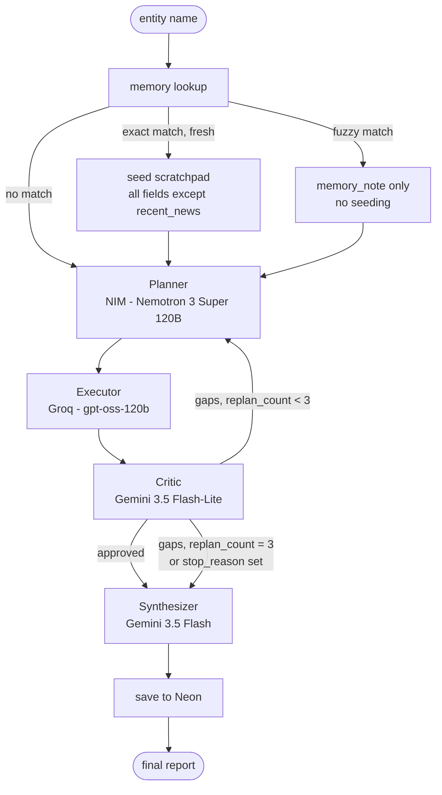

# Architecture

## Graph

With the Critic loop disabled (ablation), `executor` connects directly to `synthesizer`; the
`critic` node is not present in that graph at all, not just skipped.

## State

All nodes read and write a single `ResearchState` dict, passed through the LangGraph state graph:

| field | written by | read by |
|---|---|---|
| `entity` | caller | planner, executor, critic, synthesizer, memory |
| `today` | caller (set once at run start) | planner, executor, critic, synthesizer |
| `plan` | planner | executor |
| `scratchpad` | executor, memory seed | critic, synthesizer |
| `critique` | critic | router |
| `replan_count` | critic | router |
| `tool_call_count`, `tool_call_cache` | executor | executor (loop detection + reuse), router |
| `stop_reason` | executor, router | router, caller |
| `report`, `field_status` | synthesizer | caller |
| `memory_note` | memory seed step | caller |

Nothing is shared mutable state outside this dict — each node is a pure function of
`ResearchState -> ResearchState`, which is what makes the ablation variant (dropping the critic
node) a structural graph change rather than a conditional inside a monolithic function.

## Data flow per node

**Memory lookup** (`agent/graph.py:_seed_from_memory`, runs before the graph)
Normalizes the entity name, checks Neon for an exact match. Fresh exact match seeds the
scratchpad for every field except `recent_news`. Fuzzy match never seeds — it only sets
`memory_note` so the caller sees "possible match, not used" instead of silently getting the wrong
company's data.

**Planner** (`agent/planner.py`)
Input: entity, today's date, any Critic gaps from the previous cycle, and prior-run scratchpad
summary (so it doesn't re-plan fields already confirmed). Output: `plan`, a list of
`{sub_question, field, tool}`. The date is passed explicitly because an LLM has no reliable
built-in notion of "now", without it, `recent_news` sub-questions and the Executor's resulting
search queries have nothing to anchor "recent" to but the model's training cutoff, which is not
the same as the actual run date.

**Executor** (`agent/executor.py`)
For each pending plan step: asks the Executor model for concrete tool args, checks
`tool_call_cache` for an exact `(tool, arg)` repeat. On a repeat it does not re-call the tool
(protects the quota), but it does still write a `scratchpad` entry for the current step's field
using the cached result, so a second field asking the same underlying question isn't left
uncovered just because another field already answered it. A step whose args or tool call fail
outright is marked `failed`, distinct from a cache-hit `blocked` step, so the run log and the
final trace don't conflate "duplicate, reused" with "genuinely could not be sourced." Stops early
if `MAX_TOOL_CALLS` or `MAX_WALL_CLOCK_SECONDS` is hit, setting `stop_reason`.

**Critic** (`agent/critic.py`)
Checks the full, untruncated `scratchpad` against the 5 required fields (matching exactly what
the Synthesizer will later see, so a coverage decision here can't be based on evidence the
Synthesizer doesn't have). Returns `{approved, gaps}`; any gap name outside the 5 canonical
fields is dropped and logged rather than passed on to the Planner. If, after dropping unknown
names, `gaps` is empty, the run is treated as approved regardless of what the model's raw
`approved` flag said, since empty gaps is the actual approval condition. Every real rejection
increments `replan_count`.

**Router** (`agent/graph.py:route_after_critic`)
`approved` -> synthesizer. Gaps and `replan_count < 3` and no `stop_reason` -> back to planner.
Gaps but replan budget exhausted, or executor already set `stop_reason` -> synthesizer anyway,
so the run always terminates with whatever was confirmed rather than looping or crashing.

**Synthesizer** (`agent/synthesizer.py`)
Builds the final report from `scratchpad` only — explicitly instructed not to introduce claims
absent from it. Unfilled fields get `"insufficient information"` in `field_status` rather than a
guess.

**Save** (`agent/graph.py:run`, after the graph completes)
Only fields whose final `field_status` is `"confirmed"` are written back to `research_runs` in
Neon; a field left as `"insufficient information"` (including one abandoned by a hard stop) is
never cached, so a degraded run can't poison a future run's seed. All scratchpad entries for a
confirmed field are concatenated (not just the last one), so a field the Executor researched via
more than one search keeps all of its findings in the cache, not just the last write. This
happens whether or not the run itself started from a cache hit.

## Model families

Three distinct families across the pipeline, chosen by matching each role's free-tier rate
limits against its actual call volume per run (see the Models table in the README for the
full rationale):

- Nemotron (Planner, via NIM) — low call volume (1-4/run), NIM's free tier has no published
  daily cap, so headroom was never the constraint; picked for being NVIDIA's own model built
  for multi-step planning.
- gpt-oss-120b (Executor, via Groq; and eval Judge, via a separate Groq use case) — Executor is
  the highest-volume, most latency-sensitive role (up to 15 calls/run, streamed live to the UI),
  so it gets Groq's LPU-speed inference on its own quota. The eval Judge reuses the same model
  on a second Groq use case specifically so its quota doesn't compete with the Executor's during
  an ablation run, not because gpt-oss-120b is uniquely suited to judging.
- Gemini (Critic on `gemini-3.5-flash-lite`, Synthesizer on `gemini-3.5-flash`) — different
  models on purpose: Gemini's free-tier quotas are per-model, not per-account, so splitting
  these two across models means they draw from two separate daily buckets on the one Gemini
  account instead of one shared, tighter bucket. Critic's job (JSON gap-classification) doesn't
  need full Flash's quality; Synthesizer's job (the report the user reads) does, so it keeps the
  pricier model.

Keeping the Judge on a different model family than Critic/Synthesizer also matters for the
ablation study specifically: the study compares "Critic loop on" vs "off," and a judge from the
same family as the Critic would risk scoring outputs more favorably when they resemble its own
family's reasoning style, biasing the comparison it's supposed to be neutral about.

## Safety boundary

Every piece of tool output that originates from the open web (Tavily search results) is wrapped
in `<untrusted_web_content>` before it reaches any LLM prompt, with system instructions telling
the model that content inside is data, never instructions. Calculator output isn't wrapped —
it's derived from the model's own expression via `simpleeval`, not fetched from an external
source, so it isn't untrusted in the same sense.
