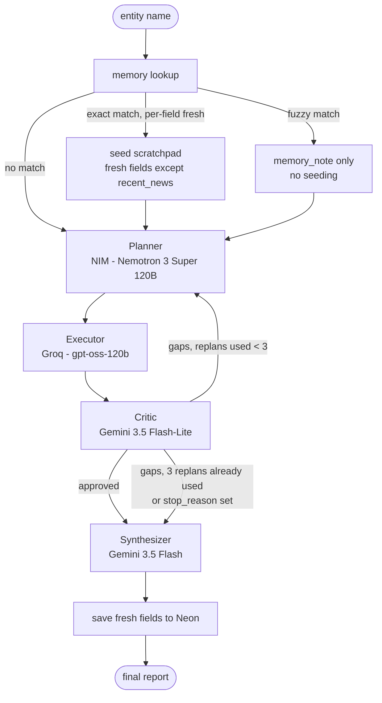

# Architecture

## Graph

```mermaid
flowchart TD
    start([entity name]) --> mem[memory lookup]
    mem -->|exact match, per-field fresh| seed[seed scratchpad\nfresh fields except recent_news]
    mem -->|fuzzy match| note[memory_note only\nno seeding]
    mem -->|no match| planner
    seed --> planner
    note --> planner

    planner[Planner\nNIM - Nemotron 3 Super 120B] --> executor[Executor\nGroq - gpt-oss-120b]
    executor --> critic[Critic\nGemini 3.5 Flash-Lite]
    critic -->|approved| synthesizer[Synthesizer\nGemini 3.5 Flash]
    critic -->|gaps, replans used < 3| planner
    critic -->|gaps, 3 replans already used\nor stop_reason set| synthesizer
    synthesizer --> save[save fresh fields to Neon]
    save --> report([final report])
```

With the Critic loop disabled (ablation), `executor` connects directly to `synthesizer`; the
`critic` node is not present in that graph at all, not just skipped.

A full run is therefore at most 4 Planner calls and 4 Critic calls (the initial pass plus 3
replans), 13 graph steps in total, which stays under LangGraph's default recursion limit of 25.

## State

All nodes read and write a single `ResearchState` dict, passed through the LangGraph state graph:

| field | written by | read by |
|---|---|---|
| `entity` | caller | planner, executor, critic, synthesizer, memory |
| `today` | caller (set once at run start) | planner, executor, critic, synthesizer |
| `plan` | planner | executor |
| `scratchpad` | executor, memory seed | planner, executor, critic, synthesizer, save |
| `critique` | critic | planner, router |
| `replan_count` | critic | router |
| `tool_call_count`, `tool_call_cache` | executor | executor (budget check, loop detection + reuse) |
| `stop_reason` | planner, executor, critic, synthesizer | critic, router, caller |
| `report`, `field_status` | synthesizer | caller, save |
| `memory_note` | `prepare_state` | caller |

`stop_reason` is a single string. When a later node has to record a second reason (the
Synthesizer failing after a replan stop, for example) the reasons are joined with `+`, e.g.
`max_replans+synthesizer_unavailable`, through `agent/guardrails.py:add_stop_reason`, and read
back with `agent/guardrails.py:stop_reasons`. The first reason is never overwritten.

Nodes are plain functions of `ResearchState -> ResearchState`. They mutate the dict they are
given and return it, rather than copying it, which is what LangGraph keeps as the node's update.
Nothing is shared outside this dict, which is what makes the ablation variant (dropping the
critic node) a structural graph change rather than a conditional inside a monolithic function.

## Data flow per node

**Run setup** (`agent/graph.py:prepare_state`, used by both `run` and the Streamlit UI)
Builds the initial state, then, when memory is enabled, seeds it from the cache and stores the
resulting `memory_note`. Sharing one function keeps the API and the UI from drifting apart.

**Memory lookup** (`agent/graph.py:seed_from_memory`, runs before the graph)
Normalizes the entity name and merges the most recent rows for an exact match per field, newest
row winning, each field keeping its own age in fractional days. Every field younger than
`MEMORY_CACHE_DAYS` except `recent_news` is seeded into the scratchpad with a
`cache, Nd old, originally: ...` source label. Fuzzy match never seeds, it only sets
`memory_note` so the caller sees "possible match, not used" instead of silently getting the wrong
company's data. Fuzzy candidates are the 2000 most recently researched entities.

**Planner** (`agent/planner.py`)
Input: entity, today's date, the findings already confirmed, and any Critic gaps from the
previous cycle. A finding counts as confirmed when it is non-empty and its field is not a current
gap, so seeded cache fields are skipped on the first pass and a field the Critic rejected is
planned again. When gaps are listed the plan covers only those fields; otherwise it covers every
field not already confirmed. The plan is capped at `MAX_PLAN_STEPS` steps. Output: `plan`, a list
of `{sub_question, field, tool}`. The date is passed explicitly because an LLM has no reliable
built-in notion of "now"; without it, `recent_news` sub-questions have nothing to anchor "recent"
to but the model's training cutoff.

**Executor** (`agent/executor.py`)
For each pending plan step: asks the Executor model for concrete tool args. The prompt lists the
queries already run so a replan does not just repeat them, and for calculator steps it also lists
the findings the expression may draw numbers from. Then it checks `tool_call_cache` for an exact
`(tool, arg)` repeat. On a repeat it does not re-call the tool (protects the quota) and records
a scratchpad entry for the current step's field from the cached result, unless that field
already holds that exact entry. A step whose args or tool call fail outright is marked `failed`,
distinct from a cache-hit `blocked` step. A calculator result is stored as `expression = value`
with source `calculator: expression`. Stops early if `MAX_TOOL_CALLS` or
`MAX_WALL_CLOCK_SECONDS` is hit, setting `stop_reason`; the clock is checked again after the
model call and before the tool runs. Every pending step costs one Executor model call, so usage
is bounded by the plan size cap rather than by `MAX_TOOL_CALLS` alone.

**Critic** (`agent/critic.py`)
Checks the full, untruncated `scratchpad` against the 5 required fields (matching exactly what
the Synthesizer will later see). Returns `{approved, gaps}`; `approved` is optional in the
response because it is recomputed from `gaps`. Any gap name outside the 5 canonical fields is
dropped and logged. If `gaps` is empty the run is approved regardless of the model's raw flag.
On a rejection, if fewer than `MAX_REPLAN_CYCLES` replans have been granted, `replan_count` is
incremented and the run goes back to the Planner. On a rejection after all replans are used,
the Critic sets `stop_reason` to `max_replans` and leaves `replan_count` at the limit, which is
what tells the router to stop looping.

**Router** (`agent/graph.py:route_after_critic`)
A pure function of state, it never writes to it. `approved` -> synthesizer. Any `stop_reason`
-> synthesizer. Gaps with no `stop_reason` -> planner. A `replan_count` above the limit, which the
Critic never produces, also goes to the synthesizer as a safety net. The run always terminates
with whatever was confirmed rather than looping or crashing.

**Synthesizer** (`agent/synthesizer.py`)
Builds the final report from `scratchpad` only, explicitly instructed not to introduce claims
absent from it. The model's `field_status` is cleaned before use: unknown keys are dropped,
unknown values become `"insufficient information"`, and a field cannot be `"confirmed"` unless
the scratchpad holds a non-empty entry tagged with it. If the call fails, or returns an empty
report, the fallback report is used: it skips empty search results, flattens each finding
to a bounded single line with its source, opens with a note that nothing was verified, and adds
`synthesizer_unavailable` to `stop_reason`.

**Save** (`agent/graph.py:save_results`, called by `agent/graph.py:run` after the graph completes)
Writes only fields that are `"confirmed"`, and only from scratchpad entries this run actually
fetched: cached (`memory`) entries and empty results are excluded, so a finding's age is never
reset and its text never grows or nests its own provenance. Nothing is written when no field
qualifies, which stops an empty run from shadowing earlier good rows, and nothing is written when
the fallback report was used. All fresh entries for a confirmed field are concatenated, not just
the last one.

## Model families

Three distinct families across the pipeline, chosen by matching each role's free-tier rate
limits against its actual call volume per run (see the Models table in the README for the
full rationale):

- Nemotron (Planner, via NIM): low call volume (1 to 4 per run), NIM's free tier has no published
  daily cap, so headroom was never the constraint; picked for being NVIDIA's own model built
  for multi-step planning.
- gpt-oss-120b (Executor, via Groq; and eval Judge, via a separate Groq key): the Executor is
  the highest-volume, most latency-sensitive role, so it gets Groq's LPU-speed inference on its
  own quota. The eval Judge reuses the same model on a second key so its quota doesn't compete
  with the Executor's during an ablation run, not because gpt-oss-120b is uniquely suited to
  judging.
- Gemini (Critic on `gemini-3.5-flash-lite`, Synthesizer on `gemini-3.5-flash`): different
  models on purpose, because Gemini's free-tier quotas are per-model, so splitting these two
  means they draw from two separate daily buckets. Critic's job (JSON gap-classification)
  doesn't need full Flash's quality; Synthesizer's job (the report the user reads) does.

The Judge grades the Synthesizer's report, which is Gemini output. It shares a model with the
Executor, but the Executor only produces tool inputs, never text the Judge scores. Keeping the
Judge off the Gemini family matters for the ablation study specifically: the study compares
"Critic loop on" vs "off," and a judge from the same family as the Critic and Synthesizer would
risk scoring outputs more favorably when they resemble its own family's reasoning style.

## Safety boundary

Every piece of tool output that originates from the open web (Tavily search results) is wrapped
in `<untrusted_web_content>` before it reaches any LLM prompt. Literal copies of the delimiter
tags inside fetched text are replaced before wrapping, and excerpts are unwrapped, truncated and
re-wrapped so the delimiters are always balanced. The Planner, Critic, Synthesizer, Executor and
Judge system prompts all include the same instruction that content inside those tags is data,
never instructions.

Calculator output isn't wrapped: it is computed by `simpleeval` from an expression, not fetched.
The expression is built from numbers the Executor read out of scratchpad findings, so those
numbers can still originate from untrusted pages. That is why the expression is stored beside
its result and shown to the Critic, Synthesizer and Judge as part of the finding and its source.
